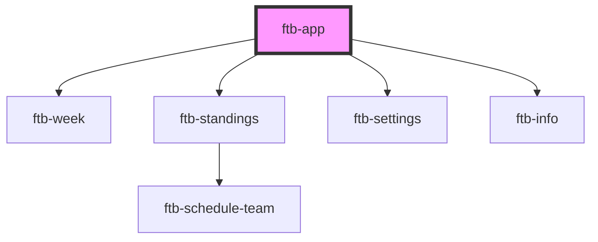

# ftb-app

<!-- Auto Generated Below -->

## Methods

### `getScheduleAndTeams() => Promise<any>`

#### Returns

Type: `Promise<any>`

### `getTeamByCode(teamCode: string) => Promise<Team>`

#### Returns

Type: `Promise<Team>`

### `getWeekMatches(week: string) => Promise<Array<Match>>`

#### Returns

Type: `Promise<Match[]>`

### `manualDataUpdate(newTeams: any, newSchedule: any) => Promise<void>`

#### Returns

Type: `Promise<void>`

### `reset() => Promise<void>`

#### Returns

Type: `Promise<void>`

### `setView(view: string) => Promise<void>`

#### Returns

Type: `Promise<void>`

### `updateMatch(week: string, winningTeamCode: string) => Promise<any>`

#### Returns

Type: `Promise<any>`

## Dependencies

### Depends on

- [ftb-week](../ftb-week)
- [ftb-standings](../ftb-standings)
- [ftb-settings](../ftb-settings)
- [ftb-info](../ftb-info)

### Graph

----------------------------------------------

*Built with [StencilJS](https://stenciljs.com/)*
