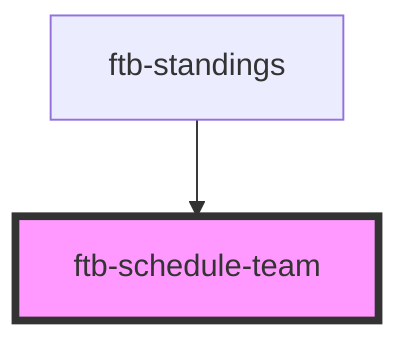

# ftb-schedule-team

<!-- Auto Generated Below -->

## Properties

| Property | Attribute | Description | Type       | Default     |
| -------- | --------- | ----------- | ---------- | ----------- |
| `even`   | `even`    |             | `boolean`  | `undefined` |
| `team`   | --        |             | `Standing` | `undefined` |

## Dependencies

### Used by

 - [ftb-standings](../ftb-standings)

### Graph

----------------------------------------------

*Built with [StencilJS](https://stenciljs.com/)*
